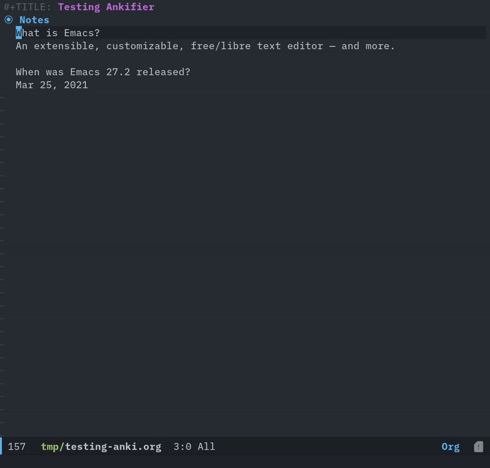

# Table of Contents

1.  [Screencast](#orgcfaa219)
2.  [Installation](#org114e63f)
    1.  [Manual](#org43efc4f)
3.  [Usage](#orgd950bdf)
    1.  [Examples](#org26a3734)
    2.  [Tips](#org4515c0a)
4.  [Changelog](#org3f613dd)
    1.  [1.0.0](#org2446d53)
5.  [Acknowledgments](#org6951c57)
6.  [Development](#org58a14ee)

Efficiently create Anki flashcards from your notes.

I created this package to facilitate faster creation of Anki cards while I study
utilizing the fantastic text editing of Emacs.

I mostly use it inside [org-noter](https://github.com/weirdNox/org-noter).

# Screencast

[]

# Installation

## Manual

Install these packages:

-   `anki-editor`
    While not *required*, this is the package that allows the output of my package
    to be sent to Anki (utilizing the [AnkiConnect](https://ankiweb.net/shared/info/2055492159) addon).

Then put this file in your load-path, and put this in your init file:

    (require 'ankifier)

# Usage

Run one of these commands on an active region:

-   `ankifier-create-basic-from-region`: Create Basic question(s) from active
    region.
-   `ankifier-create-cloze-from-region`: Create Cloze question(s) from active
    region.
-   Set `ankifier-insert-elsewhere` to `t` if you want the questions to be created
    under a `* Cards` org heading (This is what I mostly do).
    
    The name of the heading can be edited using `ankifier-cards-heading`.

Note that for a **basic** question, the questions must be separated by two newlines
and have a single question mark to indicate the *Question* part and the *Answer*
part.

## Examples

What is Emacs?
An extensible, customizable, free/libre text editor — and more.

When was Emacs 27.2 released?
Mar 25, 2021.

## Tips

-   You can customize settings in the `ankifier` group.
-   Check out [Power up Anki with Emacs, Org mode, anki-editor and more](https://yiufung.net/post/anki-org/) for ideas
    about general anki-editor use and how to get code highlighting working
    properly.

# Changelog

## 1.0.0

Initial release.

# Acknowledgments

-   This package would not have been possible without [anki-editor](https://github.com/louietan/anki-editor), which allows
    the flash cards to be sent to Anki in the first place.

# Development

Bug reports, feature requests, suggestions are all welcome, keep in mind this is
my first Emacs package!

